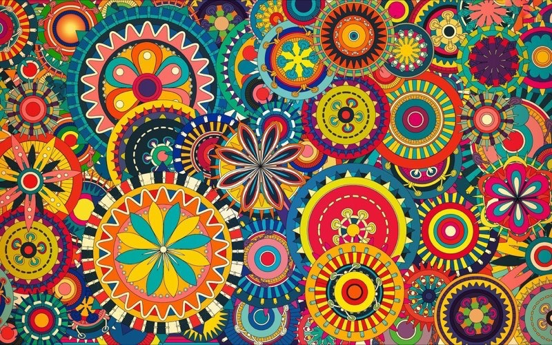
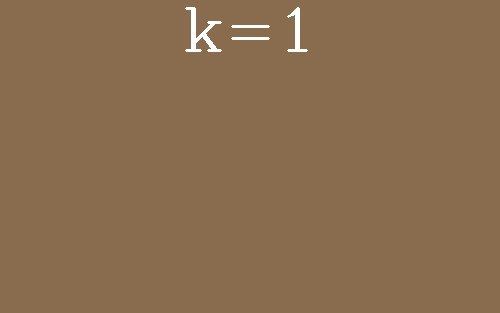

# Pixel Segmentation Using k-means Clustering

## Overview
Explore the realm of image processing with our project on pixel segmentation using k-means clustering. This tool is designed to demonstrate how k-means clustering can transform images into segmented visuals and compile the process into a GIF.

## Features
- **Image Segmentation**: Utilize k-means to segment images by pixel color.
- **Dynamic Visualization**: Generate GIFs to visualize the segmentation process across different k-values.
- **Customizable**: Suitable for any image to experiment with segmentation levels.

## Getting Started

### Prerequisites
- Python 3.6+
- Libraries: numpy, OpenCV-python, Pillow

### Installation
1. Clone the repository:
   ```bash
   git clone https://github.com/NisargBhavsar25/pixel-segmentation-using-kmeans.git
   ```
2. Navigate to the project directory:
   ```bash
   cd pixel-segmentation-using-kmeans
   ```
3. Install the required packages:
   ```bash
   pip install -r requirements.txt
   ```

### Usage
Run the main script with an optional path to your image:
```bash
python main.py --path /path/to/your/image.jpg
```
- Default image path: `images/input-image.jpg`
- Output GIF: `images/output.gif`
- Segmented images: `images/segmented-images/`

## Sample Input and Output

### Input Image


### Output GIF
Shows the segmentation process at varying levels of k-values.
